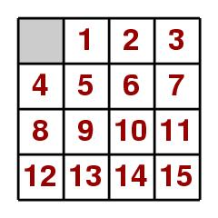

[](https://github.com/MilanPecov/15-Puzzle-Solvers/actions/workflows/tests.yaml)

# Introduction

The 15-puzzle is a classic problem that has captivated mathematics enthusiasts for centuries. The objective
is to arrange the tiles in order by sliding them into the empty space. The challenge lies in its vast 
state space, with approximately 10<sup>13</sup> possible configurations. Numerous algorithms have been 
developed to tackle the 15-puzzle, highlighting its complexity and the significant challenge it presents.

In this project, we employ advanced algorithms to effectively manage this large state space. Specifically,
the A* algorithm utilizes multiple heuristics to reduce the number of states generated and expand fewer 
nodes, thereby improving efficiency. The heuristics, such as Manhattan Distance (MD), Linear Conflict (LC),
and Walking Distance (WD), are combined in a hybrid approach to provide optimal or near-optimal solutions
while maintaining manageable space complexity.




# Installation
```
pip install fifteen-puzzle-solvers
```

# Running the puzzle solvers

This code implements two different puzzle solvers:
* Breadth First Algorithm
* __A* Algorithm__
  * **Heuristic 1:** Counting the number of misplaced tiles
  * **Heuristic 2:** Finding the sum of the Manhattan distances between each block
      and its position in the goal configuration
  * **Heuristic 3:** Combining Manhattan distance, Linear Conflict, and walking distance for a comprehensive estimate (default heuristic)

```
from fifteen_puzzle_solvers.domain import Puzzle
from fifteen_puzzle_solvers.services.algorithms import AStar, BreadthFirst
from fifteen_puzzle_solvers.services.solver import PuzzleSolver

puzzle = Puzzle([[1, 2, 3, 4], [5, 6, 7, 8], [0, 10, 11, 12], [9, 13, 14, 15]])

for strategy in [BreadthFirst, AStar]:
    puzzle_solver = PuzzleSolver(strategy(puzzle))
    puzzle_solver.run()
    puzzle_solver.print_performance()
    puzzle_solver.print_solution()  
```

Output
```
Breadth First - Expanded Nodes: 56
Solution:
—————————————
│ 1│ 2│ 3│ 4│
│ 5│ 6│ 7│ 8│
│ 0│10│11│12│
│ 9│13│14│15│
—————————————
—————————————
│ 1│ 2│ 3│ 4│
│ 5│ 6│ 7│ 8│
│ 9│10│11│12│
│ 0│13│14│15│
—————————————
—————————————
│ 1│ 2│ 3│ 4│
│ 5│ 6│ 7│ 8│
│ 9│10│11│12│
│13│ 0│14│15│
—————————————
—————————————
│ 1│ 2│ 3│ 4│
│ 5│ 6│ 7│ 8│
│ 9│10│11│12│
│13│14│ 0│15│
—————————————
—————————————
│ 1│ 2│ 3│ 4│
│ 5│ 6│ 7│ 8│
│ 9│10│11│12│
│13│14│15│ 0│
—————————————

A* - Expanded Nodes: 4
Solution:
—————————————
│ 1│ 2│ 3│ 4│
│ 5│ 6│ 7│ 8│
│ 0│10│11│12│
│ 9│13│14│15│
—————————————
—————————————
│ 1│ 2│ 3│ 4│
│ 5│ 6│ 7│ 8│
│ 9│10│11│12│
│ 0│13│14│15│
—————————————
—————————————
│ 1│ 2│ 3│ 4│
│ 5│ 6│ 7│ 8│
│ 9│10│11│12│
│13│ 0│14│15│
—————————————
—————————————
│ 1│ 2│ 3│ 4│
│ 5│ 6│ 7│ 8│
│ 9│10│11│12│
│13│14│ 0│15│
—————————————
—————————————
│ 1│ 2│ 3│ 4│
│ 5│ 6│ 7│ 8│
│ 9│10│11│12│
│13│14│15│ 0│
—————————————
```

# Testing different A* heuristic functions
```
from fifteen_puzzle_solvers.domain.puzzle import Puzzle
from fifteen_puzzle_solvers.services.algorithms import AStar
from fifteen_puzzle_solvers.services.solver import PuzzleSolver
from fifteen_puzzle_solvers.services.puzzle.shuffle import PuzzleShuffleService

# Generate a shuffled 3x3 puzzle using the PuzzleShuffleService
shuffled_puzzle = PuzzleShuffleService.shuffle_puzzle(3)

# Create a solver using the A* algorithm with the 'misplaced' heuristic
puzzle_solver = PuzzleSolver(AStar(shuffled_puzzle, heuristic='misplaced'))
puzzle_solver.run()

# Print the performance and the solution
puzzle_solver.print_performance()

>> Output: A* - Expanded Nodes: 979

puzzle_solver = PuzzleSolver(AStar(puzzle, heuristic='total'))  # default
puzzle_solver.run()
puzzle_solver.print_performance()

>> Output: A* - Expanded Nodes: 68
```

# Under the hood

Both the Breadth First and A* algorithms take an initial puzzle state as input and return a list of Puzzle objects that represent the sequence of moves needed to solve the puzzle.

## BreadthFirst

Uses a queue list to keep track of the paths that need to be explored. 
The algorithm begins by adding the initial puzzle state to the queue list. Then, it repeatedly takes the 
first path from the queue list, gets all the possible moves from the last position in the path, and adds the 
new paths to the end of the queue list. This process continues until the end position of the puzzle is reached 
or there are no more paths to explore.

## A*
The A* algorithm is an extension of the Breadth-First Search that uses heuristics to prioritize which paths to explore. It maintains a priority queue where each path is associated with a cost, which is the sum of the path length and a heuristic estimate of the remaining cost to reach the goal.
Heuristics

Heuristics are used to estimate the cost of reaching the goal from a given state. The A* algorithm in this implementation supports the following heuristics:

* Misplaced Tiles:
This heuristic counts the number of tiles that are not in their goal position. It is simple but not always very accurate.

* Manhattan Distance:
This heuristic calculates the sum of the Manhattan distances (i.e., the sum of the absolute differences of the row and column indices) of the tiles from their goal positions. It is more accurate than the misplaced tiles heuristic.

* Total Heuristic (Default):
This heuristic combines multiple heuristic functions—Manhattan distance, linear conflict, and walking distance—to provide a comprehensive estimate. This combination balances accuracy and performance, making it the default choice for solving the puzzle efficiently.